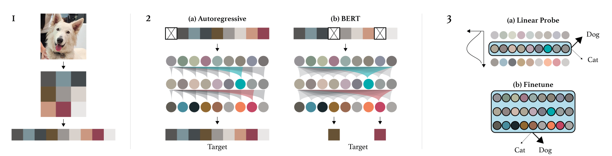

# Generative Pretraining from Pixels
从像素生成预训练 2020.6.17 https://openai.com/blog/image-gpt/ [pdf](https://cdn.openai.com/papers/Generative_Pretraining_from_Pixels_V2.pdf)

## 阅读笔记
* 将2D打平为1D的序列，分别尝试了自回归和双向掩码编码形式，自回归不同深度使用对线性探测的影响(浅层理解，深层推断); 双向掩码编码线性探测不好，微调后ok了。
* 没充分利用图像信息高冗余的特点， 没MAE的思路好，

## Abstract
Inspired by progress in unsupervised representation learning for natural language, we examine whether similar models can learn useful representations for images. We train a sequence Transformer to auto-regressively predict pixels, without incorporating knowledge of the 2D input structure. Despite training on low-resolution ImageNet without labels, we find that a GPT-2 scale model learns strong image representations as measured by linear probing, fine-tuning, and low-data classification. On CIFAR-10, we achieve 96.3% accuracy with a linear probe, outperforming a supervised Wide ResNet, and 99.0% accuracy with full finetuning, matching the top supervised pre-trained models. An even larger model trained on a mixture of ImageNet and web images is competitive with self-supervised benchmarks on ImageNet, achieving 72.0% top-1 accuracy on a linear probe of our features.

受自然语言无监督表示学习进展的启发，我们研究了类似模型是否可以学习有用的图像表示。 我们训练一个 序列Transformer 来自动回归预测像素，而无需结合 2D 输入结构的知识。 在没有标签的低分辨率 ImageNet 上进行了训练，我们发现 GPT-2 缩放模型学习了通过线性探测、微调和低数据分类测量的强大图像表示。 在 CIFAR-10 上，我们使用线性探测实现了 96.3% 的准确率，优于受监督的 Wide ResNet，并通过完全微调实现了 99.0% 的准确率，与顶级受监督的预训练模型相匹配。 在 ImageNet 和网络图像的混合体上训练的更大模型与 ImageNet 上的自监督基准相比具有竞争力，在我们的特征的线性探测上实现了 72.0% 的 top-1 准确率。

## 1. Introduction
Unsupervised pre-training played a central role in the resurgence of deep learning. Starting in the mid 2000’s, approaches such as the Deep Belief Network (Hinton et al., 2006) and Denoising Autoencoder (Vincent et al., 2008) were commonly used in neural networks for computer vision (Lee et al., 2009) and speech recognition (Mohamed et al., 2009). It was believed that a model which learned the data distribution P(X) would also learn beneficial features for the subsequent supervised modeling of P(Y |X) (Lasserre et al., 2006; Erhan et al., 2010). However, advancements such as piecewise linear activation functions (Nair & Hinton, 2010), improved initializations (Glorot & Bengio, 2010), and normalization strategies (Ioffe & Szegedy, 2015; Ba et al., 2016) removed the need for pre-training in order to achieve strong results. Other research cast doubt on the benefits of deep unsupervised representations and reported strong results using a single layer of learned features (Coates et al., 2011), or even random features (Huang et al., 2014; May et al., 2017). The approach fell out of favor as the state of the art increasingly relied on directly encoding prior structure into the model and utilizing abundant supervised data to directly learn representations (Krizhevsky et al., 2012; Graves & Jaitly, 2014). Retrospective study of unsupervised pre-training demonstrated that it could even hurt performance in modern settings (Paine et al., 2014).

无监督预训练在深度学习的复兴中发挥了核心作用。 从 2000代中期开始，深度信念网络(Hinton et al., 2006)和去噪自动编码器(Vincent et al., 2008)等方法被普遍用于计算机视觉的神经网络(Lee et al., 2009)和 语音识别(Mohamed et al., 2009)。 人们认为，学习数据分布 P(X) 的模型也将为 P(Y |X) 的后续监督建模学习有益的特征(Lasserre et al., 2006; Erhan et al., 2010)。 然而，分段线性激活函数 (Nair & Hinton, 2010)、改进的初始化 (Glorot & Bengio, 2010) 和归一化策略 (Ioffe & Szegedy, 2015; Ba et al., 2016) 等进步消除了预训练以取得强大的成果。 其他研究对深度无监督表示的好处提出了质疑，并报告了使用单层学习特征(Coates et al., 2011)甚至随机特征(Huang et al., 2014; May et al., 2017)的强大结果 . 由于现有技术越来越依赖于将先验结构直接编码到模型中并利用大量监督数据直接学习表征，因此该方法失宠了(Krizhevsky et al., 2012; Graves 和 Jaitly，2014)。 对无监督预训练的回顾性研究表明，它甚至会损害现代环境中的表现(Paine et al., 2014)。

Instead, unsupervised pre-training flourished in a different domain. After initial strong results for word vectors (Mikolov et al., 2013), it has pushed the state of the art forward in Natural Language Processing on most tasks (Dai & Le, 2015; Peters et al., 2018; Howard & Ruder, 2018;Radford et al., 2018; Devlin et al., 2018). Interestingly, the training objective of a dominant approach like BERT, the prediction of corrupted inputs, closely resembles that of the Denoising Autoencoder, which was originally developed for images.

相反，无监督预训练在另一个领域蓬勃发展。 在词向量取得初步强劲成果后(Mikolov et al., 2013)，它在大多数任务上推动了自然语言处理的最新技术水平(Dai & Le，2015; Peters et al., 2018; Howard & Ruder， 2018; Radford et al., 2018; Devlin et al., 2018)。 有趣的是，像 BERT 这样的主导方法的训练目标，即对损坏输入的预测，与最初为图像开发的去噪自动编码器的训练目标非常相似。

As a higher dimensional, noisier, and more redundant modality than text, images are believed to be difficult for generative modeling. Here, self-supervised approaches designed to encourage the modeling of more global structure (Doersch et al., 2015) have shown significant promise. A combination of new training objectives (Oord et al., 2018), more recent architectures (Gomez et al., 2017), and increased model capacity (Kolesnikov et al., 2019) has allowed these methods to achieve state of the art performance in low data settings (H´enaff et al., 2019) and sometimes even outperform supervised representations in transfer learning settings (He et al., 2019; Misra & van der Maaten, 2019; Chen et al., 2020).

作为比文本更高维、更嘈杂和更冗余的模态，图像被认为很难用于生成建模。 在这里，旨在鼓励对更多全局结构进行建模的自监督方法(Doersch et al., 2015)已显示出巨大的前景。 新的训练目标(Oord et al., 2018)、更新的架构(Gomez et al., 2017)和增加的模型容量(Kolesnikov et al., 2019)相结合，使这些方法能够实现最先进的性能 在低数据设置中(H´enaff et al., 2019)，有时甚至在迁移学习设置中表现优于监督表示(He et al., 2019; Misra & van der Maaten, 2019; Chen et al., 2020)。

Given that it has been a decade since the original wave of generative pre-training methods for images and considering their substantial impact in NLP, this class of methods is due for a modern re-examination and comparison with the recent progress of self-supervised methods. We re-evaluate generative pre-training on images and demonstrate that when using a flexible architecture (Vaswani et al., 2017), a tractable and efficient likelihood based training objective (Larochelle & Murray, 2011; Oord et al., 2016), and significant compute resources (2048 TPU cores), generative pre-training is competitive with other self-supervised approaches and learns representations that significantly improve the state of the art in low-resolution unsupervised representation learning settings.

鉴于自最初的图像生成预训练方法浪潮以来已经过去了十年，并考虑到它们在 NLP 中的重大影响，这类方法需要进行现代重新检查并与自监督方法的最新进展进行比较 . 我们重新评估图像生成预训练，并证明当使用灵活的架构(Vaswani et al., 2017)时，一个易于处理且有效的基于似然的训练目标(Larochelle & Murray，2011; Oord et al., 2016)， 和重要的计算资源(2048 个 TPU 内核)，生成式预训练与其他自监督方法相比具有竞争力，并且学习的表示可以显著改善低分辨率无监督表示学习设置中的最新技术水平。

 
Figure 1. An overview of our approach. First, we pre-process raw images by resizing to a low resolution and reshaping into a 1D sequence. We then chose one of two pre-training objectives, auto-regressive next pixel prediction or masked pixel prediction. Finally, we evaluate the representations learned by these objectives with linear probes or fine-tuning. 
图 1. 我们方法的概述。 首先，我们通过将大小调整为低分辨率并重塑为一维序列来预处理原始图像。 然后我们选择了两个预训练目标，自动回归下一个像素预测或掩码像素预测。 最后，我们使用线性探测或微调评估这些目标学习到的表征。<!--粒度由单个像素，改为小图块呢？--->

This is especially promising as our architecture uses a dense connectivity pattern which does not encode the 2D spatial structure of images yet is able to match and even outperform approaches which do. We report a set of experiments characterizing the performance of our approach on many datasets and in several different evaluation settings (low data, linear evaluation, full fine-tuning). We also conduct several experiments designed to better understand the achieved performance of these models. We investigate how representations are computed inside our model via the performance of linear probes as a function of model depth as well as studying how scaling the resolution and parameter count of the approach affects performance.

这是特别有前途的，因为我们的架构使用密集的连接模式，它不对图像的二维空间结构进行编码，但能够匹配甚至优于编码的方法。 我们报告了一组实验来表征我们的方法在许多数据集和几种不同评估设置(低数据、线性评估、完全微调)中的性能。 我们还进行了几项实验，旨在更好地了解这些模型所取得的性能。 我们研究了如何通过线性探测的性能作为模型深度的函数来计算模型内部的表示，以及研究缩放分辨率和方法的参数计数如何影响性能。

## 2. Approach
Our approach consists of a pre-training stage followed by a fine-tuning stage. In pre-training, we explore both the auto-regressive and BERT objectives. We also apply the sequence Transformer architecture to predict pixels instead of language tokens.

我们的方法包括预训练阶段和微调阶段。 在预训练中，我们探索了自回归和 BERT 目标。 我们还应用序列 Transformer 架构来预测像素而不是语言令牌。

One way to measure representation quality is to fine-tune for image classification. Fine-tuning adds a small classification head to the model, used to optimize a classification objective and adapts all weights. Pre-training can be viewed as a favorable initialization or as a regularizer when used in combination with early stopping (Erhan et al., 2010).

衡量表示质量的一种方法是微调图像分类。 Fine-tuning 在模型中添加了一个小的分类头，用于优化分类目标并调整所有权重。 当与早停结合使用时，预训练可被视为有利的初始化或正则化器 (Erhan et al., 2010)。

Another approach for measuring representation quality uses the pre-trained model as a feature extractor. In particular, given labeled examples (X, Y ), the model is applied to X to produce features $f_X$. Then, a linear classifier is trained on ($f_X$, Y ). Linear probing captures the intuition that good features should linearly separate the classes of transfer tasks. Furthermore, linear probes help disentangle feature quality from model architecture: in fine-tuning, one model may outperform another because its architecture is more suited for the downstream task rather than because of better pretraining.

另一种测量表示质量的方法使用预训练模型作为特征提取器。 特别是，给定标注样本 (X, Y)，将模型应用于 X 以生成特征 $f_X$。 然后，在 ($f_X$, Y) 上训练线性分类器。 线性探测捕捉到这样一种直觉，即良好的特征应该线性地分离迁移任务的类别。 此外，线性探测有助于从模型架构中分离出特征质量：在微调中，一个模型可能优于另一个模型，因为它的架构更适合下游任务，而不是因为更好的预训练。

We begin this section by defining the auto-regressive and BERT objectives in the context of images. Next, we outline implementation details for our transformer decoder. Finally, we describe how the transformer is used for fine-tuning and how features are extracted for linear probes.

我们通过在图像上下文中定义自回归和 BERT 目标来开始本节。 接下来，我们概述我们的转换器解码器的实现细节。 最后，我们描述了如何使用转换器进行微调以及如何为线性探测提取特征。

### 2.1. Pre-training
Given an unlabeled dataset X consisting of high dimensional data $x = (x_1, ..., x_n)$, we can pick a permutation π of the set [1, n] and model the density p(x) auto-regressively as follows: 

给定一个由高维数据 $x = (x_1, ..., x_n)$ 组成的未标注数据集 X，我们可以选择集合 [1, n] 的排列 π 并将密度 p(x) 自回归建模为 如下：

$p(x) = \prod_{i=1}^n p(x_{π_i} |x_{π_1} , ..., x_{π_{i−1}} , θ) $

When working with images, we pick the identity permutation $π_i$ = i for 1 ≤ i ≤ n, also known as raster order. We train our model by minimizing the negative log-likelihood of the data:

在处理图像时，我们选择恒等排列 $π_i$ = i for 1 ≤ i ≤ n，也称为光栅顺序。 我们通过最小化数据的负对数似然来训练我们的模型：

$L_{AR} = E_{x∼X}[− log p(x)]$

We also consider the BERT objective, which samples a sub-sequence M ⊂ [1, n] such that each index i independently has probability 0.15 of appearing in M. We call M the BERT mask, and we train our model by minimizing the negative log-likelihood of the “masked” elements $x_M$ conditioned on the “unmasked” ones $x_{[1,n]\\M}$:  <!--\M表示有点问题-->

我们还考虑了 BERT 目标，它对子序列 M ⊂ [1, n] 进行采样，使得每个索引 i 独立地具有 0.15 出现在 M 中的概率。我们称 M 为 BERT 掩码，我们通过最小化负样本来训练我们的模型 “掩码”元素 $x_M$ 的对数似然以“未掩码”元素 $x_{[1,n]\\M}$ 为条件：

$L_{BERT} = E_{x∼X} E_M \sum_{i∈M} [ − log p(x_i|x_{[1,n]\\M} )] $

In pre-training, we pick one of $L_AR$ or $L_BERT$ and minimize the loss over our pre-training dataset.

在预训练中，我们选择 $L_AR$ 或 $L_BERT$ 之一，并最大限度地减少我们预训练数据集的损失。

### 2.2. Architecture
The transformer decoder takes an input sequence $x_1, ..., x_n$ of discrete tokens and produces a d-dimensional embedding for each position. The decoder is realized as a stack of L blocks, the l-th of which produces an intermediate embedding $h^l_1 , ..., h^l_n$ also of dimension d. We use the GPT-2 (Radford et al., 2019) formulation of the transformer decoder block, which acts on an input tensor $h^l$ as follows: 

Transformer 解码器采用离散令牌的输入序列 $x_1, ..., x_n$ 并为每个位置生成 d 维嵌入。 解码器实现为 L 个块的堆栈，其中第 l 个块产生一个中间嵌入 $h^l_1 , ..., h^l_n$ 也是维度 d。 我们使用 GPT-2 (Radford et al., 2019) 变换解码器块的公式，它作用于输入张量 $h^l$ 如下：

$n^l = layer\_norm(h^l)$ 

$a^l = h^l + multihead\_attention(n^l)$ 

$h^{l+1} = a^l + mlp(layer\_norm(a^l ))$

In particular, layer norms precede both the attention and mlp operations, and all operations lie strictly on residual paths. We find that such a formulation allows us to scale the transformer with ease.

特别是，层归一化先于注意力和 mlp 操作，并且所有操作都严格位于残差路径上。 我们发现这样的公式使我们能够轻松地缩放变压器。

The only mixing across sequence elements occurs in the attention operation, and to ensure proper conditioning when training the AR objective, we apply the standard upper triangular mask to the n×n matrix of attention logits. When using the BERT objective, no attention logit masking is required: after applying content embeddings to the input sequence, we zero out the positions in M.

唯一跨序列元素的混合发生在注意力操作中，为了确保在训练 AR 目标时进行适当的调节，我们将标准上三角掩码应用于注意力逻辑的 n×n 矩阵。 使用 BERT 目标时，不需要注意 logit 掩码：在将内容嵌入应用于输入序列后，我们将 M 中的位置清零。

Additionally, since we learn independent position embeddings for each sequence element, our BERT model has no positional inductive biases (i.e. it is permutation invariant). Put another way, any spatial relationships between positions must be learned by the model at train time. This is not entirely true for the AR model, as choosing the raster order also fixes a prespecified ordering of the conditionals. Nevertheless, permutation invariance is a property in strong contrast to convolutional neural networks, which incorporate the inductive bias that features should arise from spatially proximate elements.

此外，由于我们为每个序列元素学习了独立的位置嵌入，因此我们的 BERT 模型没有位置归纳偏差(即它是排列不变的)。 换句话说，位置之间的任何空间关系都必须在训练时由模型学习。 这对 AR 模型来说并不完全正确，因为选择光栅顺序也会固定条件的预先指定顺序。 然而，置换不变性是与卷积神经网络形成强烈对比的一个属性，卷积神经网络包含特征应该来自空间邻近元素的归纳偏差。

Following the final transformer layer, we apply a layer norm $n^L = layer\_norm(h^L)$, and learn a projection from $n^L$ to logits parameterizing the conditional distributions at each sequence element. When training BERT, we simply ignore the logits at unmasked positions.

在最后的转换器层之后，我们应用层归一化 $n^L = layer \_ norm(h^L)$，并从 $n^L$ 学习投影以对每个序列元素的条件分布进行参数化。 在训练 BERT 时，我们简单地忽略未掩码位置的逻辑。

### 2.3. Fine-tuning
When fine-tuning, we average pool $n^L$ across the sequence dimension to extract a d-dimensional vector of features per example: 

微调时，我们在序列维度上对池 $n^L$ 进行平均，以提取每个样本的 d 维特征向量：

$f^L = \big< n^L_i\big>_i $

We learn a projection from $f^L$ to class logits, which we use to minimize a cross entropy loss $L^{CLF}$ .

我们学习从 $f^L$ 到类 logits 的投影，我们用它来最小化交叉熵损失 $L^{CLF}$ 。

While fine-tuning on $L^{CLF}$ yields reasonable downstream performance, we find empirically that the joint objective

虽然对 $L^{CLF}$ 进行微调会产生合理的下游性能，但我们根据经验发现联合目标

$L^{GEN} + L^{CLF}$

$L_{GEN} ∈ \{L_{AR}, L_{BERT} \}$ works even better. Similar findings were reported by Radford et al. (2018).

$L_{GEN} ∈ \{L_{AR}, L_{BERT} \}$ 效果更好。 Radford et al. (2018) 报告了类似的发现。

### 2.4. Linear Probing 线性探测
Extracting fixed features for linear probing follows a similar procedure to fine-tuning, except that average pooling is not always at the final layer: 

为线性探测提取固定特征遵循与微调类似的过程，除了平均池化并不总是在最后一层：

$f^l = \big< n^l_i\big>_i $

where 0 ≤ l ≤ L. We will show in the experiments section that the best features often lie in the middle of the network. As in fine-tuning, we project these intermediate features to produce class logits. Because we view the features as fixed when linear probing, this projection contains the only trainable weights, so we can only optimize $L_{CLF}$ .

其中 0 ≤ l ≤ L。我们将在实验部分展示最佳特征通常位于网络的中间。 与微调一样，我们投影这些中间特征以产生类 logits。 因为我们在线性探测时将特征视为固定的，所以此投影包含唯一可训练的权重，因此我们只能优化 $L_{CLF}$ 。

## 3. Methodology
Although supervised pre-training is the dominant paradigm for image classification, curating large labeled image datasets is both expensive and time consuming. Instead of further scaling up labeling efforts, we can instead aspire to learn general purpose representations from the much larger set of available unlabeled images and fine-tune them for classification. We investigate this setting using ImageNet as a proxy for a large unlabeled corpus, and small classic labeled datasets (CIFAR-10, CIFAR-100, STL-10) as proxies for downstream tasks. For our largest model, we use an additional 100 million unlabeled web images, filtered to be similar to ImageNet.

尽管有监督的预训练是图像分类的主要范例，但管理大型标注图像数据集既昂贵又耗时。 与其进一步扩大标注工作，不如从更大的可用未标注图像集中学习通用表示，并对它们进行微调以进行分类。 我们使用 ImageNet 作为大型未标注语料库的智能体来研究此设置，并使用小型经典标注数据集(CIFAR-10、CIFAR-100、STL-10)作为下游任务的智能体。 对于我们最大的模型，我们使用额外的 1 亿张未标注的网络图像，过滤后与 ImageNet 相似。

Even in cases where labels are available, unsupervised or self-supervised pre-training can still provide benefits in data efficiency or on fine-tuning speed. We investigate this setting by pre-training without labels and then fine-tuning or linear probing with labels.

即使在标签可用的情况下，无监督或自监督的预训练仍然可以在数据效率或微调速度方面带来好处。 我们通过在没有标签的情况下进行预训练然后使用标签进行微调或线性探测来研究此设置。

### 3.1. Dataset and Data Augmentation
We use the ImageNet ILSVRC 2012 training dataset, splitting off 4% as our experimental validation set and report results on the ILSVRC 2012 validation set as our test set. For CIFAR-10, CIFAR-100 and STL-10, we split off 10% of the provided training set instead. We ignore the provided unlabeled examples in STL-10, which constitute a subset of ImageNet.

我们使用 ImageNet ILSVRC 2012 训练数据集，拆分 4% 作为我们的实验验证集，并报告 ILSVRC 2012 验证集的结果作为我们的测试集。 对于 CIFAR-10、CIFAR-100 和 STL-10，我们将提供的训练集的 10% 分开。 我们忽略了 STL-10 中提供的未标注样本，它们构成了 ImageNet 的一个子集。

No data augmentation is used when pre-training on web images, and lightweight data augmentation is used when pre-training or fine-tuning on ImageNet. Specifically, when employing data augmentation, we randomly resize an image such that the shorter sidelength is in the range [256, 384] and then take a random 224 × 224 crop. When evaluating on ImageNet, we resize the image such that the shorter sidelength is 224, and use the single 224 × 224 center crop.

在网络图像上进行预训练时不使用数据增广，而在 ImageNet 上进行预训练或微调时使用轻量级数据增广。 具体来说，在使用数据增广时，我们随机调整图像大小，使较短的边长在 [256, 384] 范围内，然后随机裁剪 224 × 224。 在 ImageNet 上进行评估时，我们调整图像大小，使较短的边长为 224，并使用单个 224 × 224 中心裁剪。

When full-network fine-tuning on CIFAR-10 and CIFAR- 100, we use the augmentation popularized by Wide Residual Networks: 4 pixels are reflection padded on each side, and a 32 × 32 crop is randomly sampled from the padded image or its horizontal flip (Zagoruyko & Komodakis, 2016).

在 CIFAR-10 和 CIFAR-100 上进行全网络微调时，我们使用 Wide Residual Networks 推广的增强：每边反射填充 4 个像素，并从填充图像或其图像中随机采样 32×32 crop 水平翻转 (Zagoruyko & Komodakis, 2016)。

Once optimal hyperparameters are found, we fold our experimental validation set back into the training set, retrain the model, and report numbers on the respective test set.

一旦找到最佳超参数，我们将实验验证集折叠回训练集，重新训练模型，并报告相应测试集的数量。

### 3.2. Context Reduction 上下文缩减
Because the memory requirements of the transformer decoder scale quadratically with context length when using dense attention, we must employ further techniques to reduce context length. If we naively trained a transformer on a sequence of length $224^2$ × 3, our attention logits would be tens of thousands of times larger than those used in language models and even a single layer would not fit on a GPU. To deal with this, we first resize our image to a lower resolution, which we call the input resolution (IR). Our models have IRs of either $32^2 × 3$, $48^2 × 3$, or $64^2 × 3$.

由于在使用密集注意力时，transformer 解码器的内存需求与上下文长度呈二次方关系，因此我们必须采用进一步的技术来减少上下文长度。 如果我们天真地在长度为 $224^2$ × 3 的序列上训练一个 transformer，我们的注意力逻辑将比语言模型中使用的大几万倍，甚至单层也无法放在 GPU 上。 为了解决这个问题，我们首先将图像调整为较低的分辨率，我们称之为输入分辨率 (IR)。 我们的模型具有 $32^2 × 3$、$48^2 × 3$ 或 $64^2 × 3$ 的 IR。

An IR of $32^2 × 3$ is still quite computationally intensive. While working at even lower resolutions is tempting, prior work has demonstrated human performance on image classi- fication begins to drop rapidly below this size (Torralba et al., 2008). Instead, motivated by early color display palettes, we create our own 9-bit color palette by clustering (R, G,B) pixel values using k-means with k = 512. Using this palette yields an input sequence length 3 times shorter than the standard (R, G, B) palette, while still encoding color faithfully. A similar approach was applied to spatial patches by Ranzato et al. (2014). We call the resulting context length ($32^2$ or $48^2$ or $64^2$ ) the model resolution (MR). Note that this reduction breaks permutation invariance of the color channels, but keeps the model spatially invariant.

$32^2 × 3$ 的 IR 仍然是计算密集型的。 虽然在更低的分辨率下工作很诱人，但之前的工作已经证明人类在图像分类方面的表现开始迅速下降到这个尺寸以下(Torralba et al., 2008)。 相反，受早期彩色显示调色板的启发，我们通过使用 k = 512 的 k-means 聚类(R，G，B)像素值来创建我们自己的 9 位调色板。使用此调色板产生的输入序列长度比 标准(R、G、B)调色板，同时仍然忠实地编码颜色。 Ranzato et al 将类似的方法应用于空间分块。 (2014)。 我们将生成的上下文长度($32^2$ 或 $48^2$ 或 $64^2$)称为模型分辨率 (MR)。 请注意，这种减少打破了颜色通道的置换不变性，但保持了模型的空间不变性。

### 3.3. Model
Our largest model, iGPT-XL, contains L = 60 layers and uses an embedding size of d = 3072 for a total of 6.8B parameters. Our next largest model, iGPT-L, is essentially identical to GPT-2 with L = 48 layers, but contains a slightly smaller embedding size of d = 1536 (vs 1600) for a total of 1.4M parameters. We use the same model code as GPT-2, except that we initialize weights in the layerdependent fashion as in Sparse Transformer (Child et al., 2019) and zero-initialize all projections producing logits.

我们最大的模型 iGPT-XL 包含 L = 60 层，并使用 d = 3072 的嵌入大小，总共有 6.8B 个参数。 我们的下一个最大模型 iGPT-L 与 L = 48 层的 GPT-2 基本相同，但包含略小的嵌入大小 d = 1536(对比 1600)，总共有 1.4M 个参数。 我们使用与 GPT-2 相同的模型代码，不同之处在于我们以与稀疏变换器(Child et al., 2019)中的层相关方式初始化权重，并对所有产生 logits 的投影进行零初始化。

We also train iGPT-M, a 455M parameter model with L = 36 and d = 1024 and iGPT-S, a 76M parameter model with L = 24 and d = 512 to study the effect of model capacity on representation quality in a generative model.

我们还训练了 iGPT-M，一个 L = 36 和 d = 1024 的 455M 参数模型和 iGPT-S，一个 L = 24 和 d = 512 的 76M 参数模型，以研究模型容量对生成模型中表示质量的影响 .

### 3.4. Training
When pre-training iGPT-XL, we use a batch size of 64 and train for 2M iterations, and for all other models we use a batch size of 128 and train for 1M iterations. We use Adam with β1 = 0.9 and β2 = 0.95 and sequentially try the learning rates 0.01, 0.003, 0.001, 0.0003, ..., stopping once the final validation loss starts increasing. The learning rate is warmed up for one epoch, and then decays to 0 following a cosine schedule. No dropout is used.

在预训练 iGPT-XL 时，我们使用 64 的批量大小并训练 2M 迭代，对于所有其他模型，我们使用 128 的批量大小并训练 1M 迭代。 我们使用 β1 = 0.9 和 β2 = 0.95 的 Adam，并依次尝试学习率 0.01、0.003、0.001、0.0003，...，一旦最终验证损失开始增加就停止。 学习率预热一个时期，然后按照余弦时间表衰减到 0。 没有使用 dropout。

When fine-tuning, we use the same batch size and Adam hyperparameters. Here, we do not employ a cosine schedule, and early stop once we reach the maximum validation accuracy. Again, no dropout is used.

微调时，我们使用相同的批量大小和 Adam 超参数。 在这里，我们不使用余弦计划，一旦达到最大验证精度就提前停止。 同样，没有使用 dropout。

When running a linear probe on ImageNet, we follow recent literature and use SGD with momentum 0.9 and a high learning rate (we try the values 30, 10, 3, ... in the manner described above) (He et al., 2019). We train for 1000000 iterations with a cosine learning rate schedule. Finally, when running a linear probe on CIFAR-10, CIFAR-100, or STL- 10, we use the L-BFGS algorithm for consistency with prior results (Pedregosa et al., 2011).

在 ImageNet 上运行线性探测时，我们遵循最近的文献并使用动量为 0.9 和高学习率的 SGD(我们以上述方式尝试值 30、10、3 ...)(He et al., 2019) ). 我们使用余弦学习率计划训练 1000000 次迭代。 最后，当在 CIFAR-10、CIFAR-100 或 STL-10 上运行线性探测时，我们使用 L-BFGS 算法来与先前的结果保持一致(Pedregosa et al., 2011)。

## 4. Experiments and Results
We begin with experiments and results from the autoregressive formulation of iGPT. Comparisons with the BERT formulation appear in Section 4.6.

我们从 iGPT 的自回归公式的实验和结果开始。 与 BERT 公式的比较出现在第 4.6 节中。

### 4.1. What Representation Works Best in a Generative Model Without Latent Variables?  什么表示在没有潜在变量的生成模型中效果最好？
 
Figure 2. Representation quality depends on the layer from which we extract features. In contrast with supervised models, the best representations for these generative models lie in the middle of the network. We plot this unimodal dependence on depth by showing linear probes for iGPT-L on CIFAR-10, CIFAR-100, and STL-10.
图 2. 表示质量取决于我们从中提取特征的层。 与监督模型相比，这些生成模型的最佳表示位于网络的中间。 我们通过在 CIFAR-10、CIFAR-100 和 STL-10 上显示 iGPT-L 的线性探测来绘制这种对深度的单峰依赖性。

In supervised pre-training, representation quality tends to increase monotonically with depth, such that the best representations lie at the penultimate layer (Zeiler & Fergus, 2014). Indeed, since a linear layer produces class logits from pre-logits, a good classifier necessarily achieves high accuracy on a linear probe of its pre-logits. If a downstream task also involves classification, it is empirically validated that penultimate features perform well.

在有监督的预训练中，表示质量趋于随深度单调增加，因此最好的表示位于倒数第二层(Zeiler & Fergus，2014)。 事实上，由于线性层从 pre-logits 产生类 logits，一个好的分类器必然在其 pre-logits 的线性探测上实现高精度。 如果下游任务还涉及分类，则可以根据经验验证倒数第二个特征表现良好。

With generative pre-training, it is not obvious whether a task like pixel prediction is relevant to image classification. This suggests that the penultimate layer of a model trained for pixel prediction might not produce the most useful representations for classification. Latent variable models such as VAEs can avoid this issue by explicitly learning a representation of the input data, but deep autoregressive generative models have the same width and connectivity pattern at every layer. Our first experiment studies how representation quality varies over one set of candidate representations: different layers of a generative model. We observe a very different behavior from supervised learning: representations first improve as a function of depth, and then, starting around the middle layer, begin to deteriorate until the penultimate layer (Figure 2).

通过生成式预训练，像像素预测这样的任务是否与图像分类相关并不明显。 这表明为像素预测训练的模型的倒数第二层可能不会产生最有用的分类表示。 VAE 等潜在变量模型可以通过显式学习输入数据的表示来避免此问题，但深度自回归生成模型在每一层都具有相同的宽度和连接模式。 我们的第一个实验研究了一组候选表示的表示质量如何变化：生成模型的不同层。 我们观察到与监督学习截然不同的行为：表示首先随着深度的变化而提高，然后从中间层开始，开始恶化直到倒数第二层(图 2)。

This behavior potentially suggests that these generative models operate in two phases. In the first phase, each position gathers information from its surrounding context in order to build a more global image representation. In the second phase, this contextualized input is used to solve the conditional next pixel prediction task. This could resemble the behavior of encoder-decoder architectures common across deep learning, but learned within a monolithic architecture via a pre-training objective.

这种行为可能表明这些生成模型分两个阶段运行。 在第一阶段，每个位置都从其周围环境中收集信息，以构建更全局的图像表示。 在第二阶段，这个上下文输入被用来解决有条件的下一个像素预测任务。 这可能类似于深度学习中常见的编码器-解码器架构的行为，但通过预训练目标在整体架构中学习。

Consequently, when evaluating a generative model with a linear probe, it is important to search for the best layer. Taking the final layer on CIFAR-10 decreases performance by 2.4%, the difference between a baseline and a state-ofthe-art result. In all settings, we find that the dependence of representation quality on depth is strongly unimodal.

因此，在使用线性探测评估生成模型时，搜索最佳层非常重要。 在 CIFAR-10 上使用最后一层会使性能降低 2.4%，这是基线和最先进结果之间的差异。 在所有设置中，我们发现表示质量对深度的依赖性是强烈单模态。

### 4.2. Better Generative Models Learn Better Representations 更好的生成模型学习更好的表示
 
Figure 3. Plot of representation quality as a function of validation generative loss. Each line tracks a model throughout generative pre-training: the dotted markers denote checkpoints at steps 65K, 131K, 262K, 524K, and 1000K. The positive slope suggests a link between improved generative performance and improved representation quality. Larger models produce better representations than smaller ones both at the end of training and at the same value of validation loss. iGPT-XL is not shown since it was trained on a different dataset.
图 3. 表示质量与验证生成损失的函数关系图。 每条线在整个生成预训练过程中跟踪模型：虚线标记表示步骤 65K、131K、262K、524K 和 1000K 的检查点。 正斜率表明改进的生成性能和改进的表示质量之间存在联系。 在训练结束时和验证损失值相同时，较大的模型比较小的模型产生更好的表示。 iGPT-XL 未显示，因为它是在不同的数据集上训练的。

Using the linear probe as a tool for measuring representation quality, we investigate whether better generative models (as measured by log-prob on held-out data) also learn better representations.

使用线性探测作为衡量表征质量的工具，我们研究了更好的生成模型(通过保留数据上的对数概率衡量)是否也能学习到更好的表征。

In Figure 3, we see that as validation loss on the autoregressive objective decreases throughout training, linear probe accuracy increases as well. This trend holds across several model capacities, with higher capacity models achieving better validation losses. This highlights the importance of scale for our approach. Note that for a given validation loss value, bigger models also perform better.

在图3 中，我们看到随着自回归目标的验证损失在整个训练过程中减少，线性探测精度也会增加。 这种趋势适用于多个模型容量，更高容量的模型实现更好的验证损失。 这突出了规模对我们方法的重要性。 请注意，对于给定的验证损失值，更大的模型也表现更好。

### 4.3. Linear Probes on CIFAR and STL-10  
In addition to CIFAR-10, we also evaluate linear probes on CIFAR-100 and STL-10 (Figure 2) to check whether the learned representations are useful across multiple datasets. For this evaluation setting, we achieve state-of-the-art across the entire spectrum of pre-training approaches (Table 1). For example, on CIFAR-10, our model achieves 96.3%, outperforming both SimCLR (pre-trained on ImageNet without labels) and a ResNet-152 (pre-trained on ImageNet with labels). In fact, on all three datasets a linear classifier fit to the representations of iGPT-L outperforms the end-to-end supervised training of a WideResNet baseline.

除了 CIFAR-10 之外，我们还在 CIFAR-100 和 STL-10(图 2)上评估线性探测，以检查学习的表示是否对多个数据集有用。 对于此评估设置，我们在整个预训练方法范围内实现了最先进的技术(表 1)。 例如，在 CIFAR-10 上，我们的模型达到了 96.3%，优于 SimCLR(在没有标签的 ImageNet 上预训练)和 ResNet-152(在有标签的 ImageNet 上预训练)。 事实上，在所有三个数据集上，适合 iGPT-L 表示的线性分类器优于 WideResNet 基线的端到端监督训练。

 
Table 1. Comparing linear probe accuracies between our models and state-of-the-art models utilizing unsupervised ImageNet transfer or supervised ImageNet transfer.
表 1. 比较我们的模型和使用无监督 ImageNet 传输或监督 ImageNet 传输的最先进模型之间的线性探测精度。

Note that our model is trained at the same input resolution (IR) as CIFAR, whereas models trained at the standard ImageNet IR may experience distribution shock upon linear evaluation. As a counterpoint, though STL-10 has an IR of $96^2$ × 3, we still outperform AMDIM-L when we downsample to $32^2 × 3$ before linear probing. We also note that fine-tuning should allow models trained at high IR to adjust to low resolution input.

请注意，我们的模型是在与 CIFAR 相同的输入分辨率 (IR) 下训练的，而在标准 ImageNet IR 上训练的模型可能会在线性评估时经历分布冲击。 作为对比，虽然 STL-10 的 IR 为 $96^2$ × 3，但当我们在线性探测之前将采样率降低到 $32^2 × 3$ 时，我们仍然优于 AMDIM-L。 我们还注意到微调应该允许在高 IR 下训练的模型适应低分辨率输入。

### 4.4. Linear Probes on ImageNet
Recently, there has been a resurgence of interest in unsupervised and self-supervised learning on ImageNet, evaluated using linear probes on ImageNet. This is a particularly difficult setting for us, since we cannot efficiently train at the standard ImageNet input resolution (IR). Indeed, when training iGPT-L with a model resolution (MR) of $32^2$ , we achieve only 60.3% best-layer linear probe accuracy. As with CIFAR-10, scale is critical to our approach: iGPT-M achieves 54.5% accuracy and iGPT-S achieves 41.9% accuracy.

最近，人们对 ImageNet 上的无监督和自监督学习重新产生了兴趣，这些学习是在 ImageNet 上使用线性探测进行评估的。 这对我们来说是一个特别困难的设置，因为我们无法在标准 ImageNet 输入分辨率 (IR) 下进行有效训练。 事实上，当训练模型分辨率 (MR) 为 $32^2$ 的 iGPT-L 时，我们仅获得 60.3% 的最佳层线性探测精度。 与 CIFAR-10 一样，规模对我们的方法至关重要：iGPT-M 达到 54.5% 的准确度，iGPT-S 达到 41.9% 准确性。

Table 2. Comparing linear probe accuracies between our models and state-of-the-art self-supervised models. A blank input resolution (IR) corresponds to a model working at standard ImageNet resolution. We report the best performing configuration for each contrastive method, finding that our models achieve comparable performance.
表 2. 比较我们的模型和最先进的自监督模型之间的线性探测精度。 空白输入分辨率 (IR) 对应于以标准 ImageNet 分辨率工作的模型。 我们报告了每种对比方法的最佳性能配置，发现我们的模型达到了可比的性能。

Method|IR|Params(M)|Features|Acc
---|---|---|---| ---
Rotation|orig.|86|8192|55.4|iGPT-L|$32^2$|·3|1362|1536|60.3
BigBiGAN|orig.|86|8192|61.3|iGPT-L|$48^2$|·3|1362|1536|65.2
AMDIM|orig.|626|8192|68.1
MoCo|orig.|375|8192|68.6|iGPT-XL|$64^2$|·3|6801|3072|68.7
SimCLR|orig.|24|2048|69.3
CPC|v2|orig.|303|8192|71.5|iGPT-XL|$64^2$|·3|6801|15360|72.0
SimCLR|orig.|375|8192|76.5
M|achieves|54.5%|accuracy|and|iGPT-S|achieves|41.9%|accuracy.

The first obvious optimization is to increase MR while staying within accelerator memory limits. With a MR of $48^2$, iGPT-L achieves a best-layer accuracy of 65.2% using 1536 features and with a MR of $64^2$ , iGPT-XL achieves a bestlayer accuracy of 68.7% using 3072 features.

第一个明显的优化是增加 MR，同时保持在加速器内存限制内。 MR 为 $48^2$ 时，iGPT-L 使用 1536 个特征实现了 65.2% 的最佳层精度，而 MR 为 $64^2$ 时，iGPT-XL 使用 3072 个特征实现了 68.7% 的最佳层精度。

Since contrastive methods report their best results on 8192 features, we would ideally evaluate iGPT with an embedding dimension 8192 for comparison. Training such a model is prohibitively expensive, so we instead concatenate features from multiple layers as an approximation. However, our features tend to be correlated across layers, so we need more of them to be competitive. If we concatenate features from 5 layers centered at the best single layer of iGPT-XL, we achieve an accuracy of 72.0% using 15360 features, which is competitive with recent contrastive learning approaches (Table 2). Note that we require more parameters and compute to achieve this accuracy, but we work at low resolution and without utilizing knowledge of the 2D input structure.

由于对比方法报告了它们在 8192 个特征上的最佳结果，因此我们理想地评估嵌入维度为 8192 的 iGPT 以进行比较。 训练这样的模型非常昂贵，因此我们将来自多个层的特征连接起来作为近似值。 然而，我们的特征往往是跨层相关的，所以我们需要更多的特征来保持竞争力。 如果我们连接以 iGPT-XL 最佳单层为中心的 5 层特征，我们使用 15360 个特征实现了 72.0% 的准确率，这与最近的对比学习方法相比具有竞争力(表 2)。 请注意，我们需要更多的参数和计算来达到这种精度，但我们在低分辨率下工作并且没有利用 2D 输入结构的知识。

### 4.5. Full Fine-tuning
To achieve even higher accuracy on downstream tasks, we adapt the entire model for classification through fine-tuning. Building off of the previous analysis, we tried attaching the classification head to the layer with the best representations. Though this setup trains faster than one with the head attached at the end, the latter is able to leverage greater model depth and eventually outperforms.

为了在下游任务上实现更高的准确性，我们通过微调调整整个模型以进行分类。 基于之前的分析，我们尝试将分类头附加到具有最佳表示的层。 虽然这种设置比最后附有头部的设置训练得更快，但后者能够利用更大的模型深度并最终胜出。

On CIFAR-10, iGPT-L achieves 99.0% accuracy and on CIFAR-100, it achieves 88.5% accuracy after fine-tuning. We outperform AutoAugment, the best supervised model on these datasets, though we do not use sophisticated data augmentation techniques. In fact, 99.0% ties GPipe, the best model which pre-trains using ImageNet labels.

在 CIFAR-10 上，iGPT-L 达到 99.0% 的准确率，在 CIFAR-100 上，经过微调后达到 88.5% 的准确率。 尽管我们没有使用复杂的数据增强技术，但我们的表现优于 AutoAugment，这是这些数据集上最好的监督模型。 事实上，99.0% 与 GPipe 相关，GPipe 是使用 ImageNet 标签进行预训练的最佳模型。

 
Table 3. Comparing fine-tuning performance between our models and state-of-the-art models utilizing supervised ImageNet transfer. We also include AutoAugment, the best performing model trained end-to-end on CIFAR. Table results: AutoAugment (Cubuk et al., 2019), SimCLR (Chen et al., 2020), GPipe (Huang et al., 2019), EfficentNet (Tan & Le, 2019)
表 3. 比较我们的模型和使用受监督的 ImageNet 传输的最先进模型之间的微调性能。 我们还包括 AutoAugment，这是在 CIFAR 上端到端训练的最佳性能模型。 表结果：AutoAugment (Cubuk et al., 2019)、SimCLR (Chen et al., 2020)、GPipe (Huang et al., 2019)、EfficentNet (Tan & Le, 2019)

On ImageNet, we achieve 66.3% accuracy after fine-tuning at MR $32^2$ , a bump of 6% over linear probing. When finetuning at MR $48^2$ , we achieve 72.6% accuracy, with a similar 7% bump over linear probing. However, our models still slightly underperform Isometric Neural Nets (Sandler et al., 2019), which achieves 70.2% at an IR of 282 × 3.

在 ImageNet 上，我们在 MR $32^2$ 微调后实现了 66.3% 的准确度，比线性探测提高了 6%。 当以 MR $48^2$ 进行微调时，我们达到了 72.6% 的准确度，与线性探测相比有类似的 7% 的提升。 然而，我们的模型仍然略逊于等距神经网络 (Sandler et al., 2019)，后者在 282 × 3 的 IR 下达到 70.2%。

Finally, as a baseline for ImageNet fine-tuning, we train the classification objective from a random initialization. At MR $48^2$ , a model with tuned learning rate and dropout achieves 53.2% after 18 epochs, 19.4% worse than the pretrained model. Comparatively, the pre-trained model is much quicker to fine-tune, achieving the same 53.2% loss in roughly a single epoch.

最后，作为 ImageNet 微调的基线，我们从随机初始化中训练分类目标。 在 MR $48^2$ 时，具有调整学习率和 dropout 的模型在 18 个 epoch 后达到 53.2%，比预训练模型差 19.4%。 相比之下，预训练模型的微调速度要快得多，在大约一个时期内实现了同样的 53.2% 损失。

When fine-tuning, it is important to search over learning rates again, as the optimal learning rate on the joint training objective is often an order of magnitude smaller than that for pre-training. We also tried regularizing with dropout, though we did not observe any clear benefits. It is easy to overfit the classification objective on small datasets, so we employ early stopping based on validation accuracy.

微调时，再次搜索学习率很重要，因为联合训练目标的最佳学习率通常比预训练小一个数量级。 我们还尝试使用 dropout 进行正则化，尽管我们没有观察到任何明显的好处。 小数据集上的分类目标很容易过度拟合，因此我们采用基于验证准确性的提前停止。

### 4.6. BERT
Given the success of BERT in language, we train iGPT-L at an input resolution of $32^2 × 3$ and a model resolution of $32^2$ (Figure 4). On CIFAR-10, we observe that linear probe accuracy at every layer is worse than that of the autoregressive model, with best-layer performance more than 1% lower. Best-layer accuracy on ImageNet is 6% lower.

鉴于 BERT 在语言方面的成功，我们以 $32^2 × 3$ 的输入分辨率和 $32^2$ 的模型分辨率训练 iGPT-L(图 4)。 在 CIFAR-10 上，我们观察到每一层的线性探测精度都比自回归模型差，最佳层性能低 1% 以上。 ImageNet 上的最佳层精度降低了 6%。

However, during fine-tuning, BERT makes up much of this gap. A fully fine-tuned CIFAR-10 model achieves 98.6% accuracy, only 0.4% behind its auto-regressive counterpart, while a fully fine-tuned ImageNet model achieves 66.5%, slightly surpassing auto-regressive performance.

然而，在微调期间，BERT 弥补了这一差距。 完全微调的 CIFAR-10 模型达到 98.6% 的准确率，仅比其自回归模型低 0.4%，而完全微调的 ImageNet 模型达到 66.5%，略高于自回归性能。

 
Figure 4. Comparison of auto-regressive pre-training with BERT pre-training using iGPT-L at an input resolution of $32^2 × 3$. Blue bars display linear probe accuracy and orange bars display finetune accuracy. Bold colors show the performance boost from ensembling BERT masks. We see that auto-regressive models produce much better features than BERT models after pre-training, but BERT models catch up after fine-tuning. 
图 4. 使用 iGPT-L 在 $32^2 × 3$ 输入分辨率下使用 iGPT-L 进行自动回归预训练与 BERT 预训练的比较。蓝色条显示线性探测精度，橙色条显示微调精度。 大胆的颜色显示了集成 BERT 掩模带来的性能提升。 我们看到自回归模型在预训练后产生的特征比 BERT 模型好得多，但 BERT 模型在微调后赶上来了。

Finally, because inputs to the BERT model are masked at training time, we must also mask them at evaluation time to keep inputs in-distribution. This masking corruption may hinder the BERT model’s ability to correctly predict image classes. Therefore, we also try an evaluation scheme where we sample 5 independent masks for each input and take the modal prediction, breaking ties at random. In this setting, CIFAR-10 results are largely unchanged, but on ImageNet, we gain almost 1% on our linear probes and fine-tunes.

最后，由于 BERT 模型的输入在训练时被屏蔽，我们还必须在评估时屏蔽它们以保持输入分布。 这种掩蔽损坏可能会阻碍 BERT 模型正确预测图像类别的能力。 因此，我们还尝试了一种评估方案，我们为每个输入采样 5 个独立的掩码并进行模态预测，随机打破平局。 在此设置中，CIFAR-10 结果基本没有变化，但在 ImageNet 上，我们的线性探测和微调获得了近 1% 的收益。

### 4.7. Low-Data CIFAR-10 Classification
Evaluations of unsupervised representations often reuse supervised learning datasets which have thousands to millions of labeled examples. However, a representation which has robustly encoded a semantic concept should be exceedingly data efficient. As inspiration, we note that humans are able to reliably recognize even novel concepts with a single example (Carey and Bartlett 1978). This motivates evaluating performance in a low-data regime as well. It is also a more realistic evaluation setting for the potential practical usefulness of an approach since it better matches the common real-world scenario of an abundance of raw data but a lack of labels.

无监督表示的评估通常会重复使用具有数千到数百万个标记样本的监督学习数据集。 然而，对语义概念进行稳健编码的表示应该具有极高的数据效率。 作为灵感，我们注意到人类甚至能够通过一个例子可靠地识别新概念(Carey 和 Bartlett 1978)。 这也激发了在低数据状态下评估性能。 对于方法的潜在实际用途，它也是一个更现实的评估设置，因为它更符合大量原始数据但缺乏标签的常见现实场景。

In contrast with recent approaches for low-data classification, we do not make use of pseudo-labeling or data augmentation. Instead, we work directly on a subset of the raw supervised dataset, extracting features using our pre-trained model, and training a linear classifier on those features.

与最近的低数据分类方法相比，我们不使用伪标签或数据增强。 相反，我们直接在原始监督数据集的一个子集上工作，使用我们预训练的模型提取特征，并在这些特征上训练线性分类器。

 
Table 4. Comparing performance on low-data CIFAR-10. By leveraging many unlabeled ImageNet images, iGPT-L is able to outperform methods such as Mean Teacher (Tarvainen & Valpola, 2017) and MixMatch (Berthelot et al., 2019) but still underperforms the state of the art methods (Xie et al., 2019; Sohn et al., 2020). Our approach to semi-supervised learning is very simple since we only fit a logistic regression classifier on iGPT-L’s features without any data augmentation or fine-tuning - a significant difference from specially designed semi-supervised approaches. Other results reported from FixMatch (Sohn et al., 2020).
表 4. 比较低数据 CIFAR-10 的性能。 通过利用许多未标记的 ImageNet 图像，iGPT-L 能够胜过 Mean Teacher (Tarvainen & Valpola, 2017) 和 MixMatch (Berthelot et al., 2019) 等方法，但仍低于最先进的方法 (Xie et al. , 2019; Sohn et al., 2020)。 我们的半监督学习方法非常简单，因为我们只在 iGPT-L 的特征上拟合逻辑回归分类器，没有任何数据增强或微调——这与专门设计的半监督方法有显著差异。 FixMatch 报告的其他结果(Sohn et al., 2020)。

As is standard in the low-data setting, we sample 5 random subsets and report mean and standard deviation accuracies (Table 4). On CIFAR-10, we find that with 4 labels per class, we achieve 73.2% accuracy outperforming MixMatch with much lower variance between runs and with 25 labels per class, we achieve 87.6% accuracy, though still significantly lower than the state of the art, FixMatch.

作为低数据设置中的标准，我们抽取 5 个随机子集并报告平均和标准差精度(表 4)。 在 CIFAR-10 上，我们发现每个类有 4 个标签，我们获得了 73.2% 的准确率，优于 MixMatch，运行之间的方差低得多，每个类有 25 个标签，我们获得了 87.6% 的准确率，但仍然明显低于现有技术水平 , 修复匹配。

Although we have established that large models are necessary for producing good representations, large models are also difficult to fine-tune in the ultra-low data regime. Indeed, we find that iGPT-L quickly memorizes a 40-example training set and fails to generalize well, achieving only 42.1% accuracy. We expect adapting recent approaches to semi-supervised learning will help in this setting.

虽然我们已经确定大型模型对于产生良好的表示是必要的，但大型模型也难以在超低数据范围内进行微调。 事实上，我们发现 iGPT-L 可以快速记住 40 个样本的训练集，但不能很好地泛化，准确率仅为 42.1%。 我们期望将最近的方法应用于半监督学习将有助于这种情况。

## 5. Related Work
Many generative models have been developed and evaluated for their representation learning capabilities. Notably, GANs (Goodfellow et al., 2014; Radford et al., 2015; Donahue et al., 2016) and VAEs (Kingma & Welling, 2013; Kingma et al., 2014; Higgins et al., 2017) have been wellstudied.

已经开发了许多生成模型并评估了它们的表示学习能力。 值得注意的是，GANs(Goodfellow et al., 2014; Radford et al., 2015; Donahue et al., 2016)和 VAEs(Kingma & Welling，2013; Kingma et al., 2014; Higgins et al., 2017) 好好研究。

As of yet, most generative model based approaches have not been competitive with supervised and self-supervised methods in the image domain. A notable exception is BigBiGAN (Donahue & Simonyan, 2019) which first demonstrated that sufficiently high fidelity generative models learn image representations which are competitive with other selfsupervised methods.

到目前为止，大多数基于生成模型的方法在图像领域还没有与监督和自监督方法竞争。 一个值得注意的例外是 BigBiGAN(Donahue & Simonyan，2019)，它首先证明了足够高保真度的生成模型学习图像表示，这与其他自监督方法具有竞争力。

Many self-supervised approaches focus on designing auxiliary objectives which support the learning of useful representations without attempting to directly model the input data. Examples include surrogate classification (Dosovitskiy et al., 2015), jigsaw puzzle solving (Noroozi & Favaro, 2016), and rotation prediction (Gidaris et al., 2018). A cluster of similar approaches based on contrastive losses comparing various views and transformations of input images have recently driven significant progress in self-supervised learning (Hjelm et al., 2018; Bachman et al., 2019; Tian et al., 2019).

许多自监督方法侧重于设计辅助目标，这些目标支持学习有用的表示，而无需尝试直接对输入数据建模。 样本包括智能体分类(Dosovitskiy et al., 2015)、拼图解谜(Noroozi & Favaro，2016)和旋转预测(Gidaris et al., 2018)。 一组基于对比损失比较输入图像的各种视图和转换的类似方法最近推动了自监督学习的重大进展(Hjelm et al., 2018; Bachman et al., 2019; Tian et al., 2019)。

Among contrastive approaches, our work is most similar to Contrast Predictive Coding (Oord et al., 2018) which also utilizes a autoregressive prediction objective, but in a learned latent space, and to Selfie (Trinh et al., 2019) which trains a bidirectional self-attention architecture on top of a standard convolutional network to differentiate correct vs wrong patches.

在对比方法中，我们的工作与 对比预测编码(Oord et al., 2018) 最相似，它也使用自回归预测目标，但在学习的潜在空间中，以及 Selfie (Trinh et al., 2019)，它训练一个 标准卷积网络之上的双向自注意力架构，以区分正确与错误的分块。

Our work is directly inspired by the success of generative pre-training methods developed for Natural Language Processing. These methods predict some parts of a piece of text conditioned on other parts. Our work explores two training objectives in this framework, autoregressive prediction as originally explored for modern neural sequence models by Dai & Le (2015), and a denoising objective, similar to BERT (Devlin et al., 2018). The context in-painting approach of Pathak et al. (2016) also explores pre-training by predicting corruptions but predicts large regions of high-resolution images.

我们的工作直接受到为自然语言处理开发的生成式预训练方法的成功启发。 这些方法预测一段文本的某些部分以其他部分为条件。 我们的工作探索了该框架中的两个训练目标，即最初由 Dai & Le (2015) 为现代神经序列模型探索的自回归预测，以及类似于 BERT 的去噪目标 (Devlin et al., 2018)。 Pathak et al.(2016) 的上下文绘画方法也通过预测损坏来探索预训练，但预测高分辨率图像的大区域。

Kolesnikov et al. (2019); Goyal et al. (2019) conducted rigorous investigations of existing self-supervised methods. Several of our findings are consistent with their results, including the benefits of scale and the non-monotonic performance of representations with depth in certain architectures.

Kolesnikov et al. (2019); Goyal et al. (2019) 对现有的自监督方法进行了严格的调查。 我们的一些发现与他们的结果一致，包括规模优势和某些架构中具有深度的表示的非单调性能。

Expressive autoregressive models tractably optimizing likelihood were first applied to images by Uria et al. (2013) and popularized by Oord et al. (2016) serving for the basis of several papers similarly adapting transformers to the problem of generative image modeling (Parmar et al., 2018;Child et al., 2019).

Uria et al. (2013)首先将表达性自回归模型轻松优化似然率应用于图像, 并由 Oord et al. (2016)推广作为几篇论文的基础，类似地使变压器适应生成图像建模的问题(Parmar et al., 2018;Child et al., 2019)。

Ke et al. (2018) introduced the pixel-by-pixel CIFAR10 task and first benchmarked the performance of a 1D sequence transformer on a competitive image classification dataset. Rives et al. (2019) similarly investigates whether the recent success of unsupervised pre-training in NLP applies to other domains, observing promising results on protein sequence data.

Ke et al. (2018) 介绍了逐像素 CIFAR10 任务，并首先在竞争性图像分类数据集上对一维序列变换器的性能进行了基准测试。 Rives et al. (2019) 同样调查了最近 NLP 无监督预训练的成功是否适用于其他领域，在蛋白质序列数据上观察到有希望的结果。

## 6. Discussion and Conclusion
Our results suggest that generative image modeling continues to be a promising route to learn high-quality unsupervised image representations. Simply predicting pixels learns state of the art representations for low resolution datasets. In high resolution settings, our approach is also competitive with other self-supervised results on ImageNet.

我们的结果表明，生成图像建模仍然是学习高质量无监督图像表示的有前途的途径。 简单地预测像素可以学习低分辨率数据集的最先进表示。 在高分辨率设置下，我们的方法也可以与 ImageNet 上的其他自监督结果相媲美。

However, our experiments also demonstrate several areas for improvement. We currently model low resolution inputs with self-attention. By comparison, most other selfsupervised results use CNN based encoders that easily work with high resolution images. It is not immediately obvious how to best bridge the gap between performant autoregressive and discriminative models. Additionally, we observed that our approach requires large models in order to learn high quality representations. iGPT-L has 2 to 3 times as many parameters as similarly performing models on ImageNet and uses more compute.

然而，我们的实验也展示了几个需要改进的地方。 我们目前使用自注意力对低分辨率输入进行建模。 相比之下，大多数其他自监督结果使用基于 CNN 的编码器，可以轻松处理高分辨率图像。 目前还不清楚如何最好地弥合自回归模型和判别模型之间的性能差距。 此外，我们观察到我们的方法需要大型模型才能学习高质量的表征。 iGPT-L 的参数是 ImageNet 上类似性能模型的 2 到 3 倍，并且使用更多计算。

Although dense self-attention was a deliberate choice for this work due to it being domain agnostic and widely used in NLP, it becomes very memory and computationally expensive due to its quadratic scaling with sequence length. We mitigated this via the context reduction techniques discussed in section 3.2 but it is still a significant limitation. Future work could instead address this via architectural changes by exploring more efficient self-attention approaches. Several promising techniques have recently been developed such as local 2D relative attention (Bello et al., 2019; Ramachandran et al., 2019), sparse attention patterns (Child et al., 2019), locality sensitive hashing (Kitaev et al., 2020), and multiscale modeling (Menick & Kalchbrenner, 2018).

尽管密集自注意力是这项工作的有意选择，因为它与领域无关并且在 NLP 中广泛使用，但由于其与序列长度的二次缩放，它变得非常内存和计算昂贵。 我们通过 3.2 节中讨论的上下文缩减技术缓解了这种情况，但这仍然是一个重大限制。 未来的工作可以通过探索更有效的自注意力方法来通过架构变化来解决这个问题。 最近开发了几种有前途的技术，例如<strong>局部 2D 相对注意力(Bello et al., 2019; Ramachandran et al., 2019)、稀疏注意力模式(Child et al., 2019)、局部敏感哈希(Kitaev et al.,  2020)和多尺度建模(Menick & Kalchbrenner，2018)</strong>。

Finally, our results, considered together with Donahue & Simonyan (2019), suggest revisiting the representation learning capabilities of other families of generative models such as flows (Dinh et al., 2014; Kingma & Dhariwal, 2018) and VAEs in order to study whether they show similarly competitive representation learning capabilities.

最后，我们的结果与 Donahue 和 Simonyan (2019) 一起考虑，建议重新审视其他生成模型系列的表示学习能力，例如流(Dinh et al., 2014; Kingma 和 Dhariwal，2018)和 VAE，以便研究 他们是否表现出类似的竞争性表征学习能力。

## References
* Ba, J. L., Kiros, J. R., and Hinton, G. E. Layer normalization. arXiv preprint arXiv:1607.06450, 2016. 
* Bachman, P., Hjelm, R. D., and Buchwalter, W. Learning representations by maximizing mutual information across views. In Advances in Neural Information Processing Systems, pp. 15509–15519, 2019. 
* Bello, I., Zoph, B., Vaswani, A., Shlens, J., and Le, Q. V. Attention augmented convolutional networks. In Proceed￾ings of the IEEE International Conference on Computer Vision, pp. 3286–3295, 2019. 
* Berthelot, D., Carlini, N., Goodfellow, I., Papernot, N., Oliver, A., and Raffel, C. A. Mixmatch: A holistic approach to semi-supervised learning. In Advances in Neural Information Processing Systems, pp. 5050–5060, 2019. 
* Chen, T., Kornblith, S., Norouzi, M., and Hinton, G. A simple framework for contrastive learning of visual rep￾resentations. arXiv preprint arXiv:2002.05709, 2020. 
* Generative Pretraining from Pixels Child, R., Gray, S., Radford, A., and Sutskever, I. Gen￾erating long sequences with sparse transformers. arXiv preprint arXiv:1904.10509, 2019. 
* Coates, A., Ng, A., and Lee, H. An analysis of single￾layer networks in unsupervised feature learning. In Pro￾ceedings of the fourteenth international conference on artificial intelligence and statistics, pp. 215–223, 2011. 
* Cubuk, E., Zoph, B., Mane, D., Vasudevan, V., and Le, Q. V. Autoaugment: Learning augmentation strategies from data, 2019. 
* Dai, A. M. and Le, Q. V. Semi-supervised sequence learning. In Advances in neural information processing systems, pp. 3079–3087, 2015. 
* Devlin, J., Chang, M.-W., Lee, K., and Toutanova, K. Bert: Pre-training of deep bidirectional transformers for lan￾guage understanding. arXiv preprint arXiv:1810.04805, 2018. 
* Dinh, L., Krueger, D., and Bengio, Y. Nice: Non-linear independent components estimation. arXiv preprint arXiv:1410.8516, 2014. 
* Doersch, C., Gupta, A., and Efros, A. A. Unsupervised visual representation learning by context prediction. In Proceedings of the IEEE International Conference on Computer Vision, pp. 1422–1430, 2015. 
* Donahue, J. and Simonyan, K. Large scale adversarial rep￾resentation learning. In Advances in Neural Information Processing Systems, pp. 10541–10551, 2019. 
* Donahue, J., Kr¨ahenb¨uhl, P., and Darrell, T. Adversarial feature learning. arXiv preprint arXiv:1605.09782, 2016. 
* Dosovitskiy, A., Fischer, P., Springenberg, J. T., Riedmiller, M., and Brox, T. Discriminative unsupervised feature learning with exemplar convolutional neural networks. 
* IEEE transactions on pattern analysis and machine intel￾ligence, 38(9):1734–1747, 2015. 
* Erhan, D., Bengio, Y., Courville, A., Manzagol, P.-A., Vin￾cent, P., and Bengio, S. Why does unsupervised pre￾training help deep learning? Journal of Machine Learn￾ing Research, 11(Feb):625–660, 2010. 
* Gidaris, S., Singh, P., and Komodakis, N. Unsupervised rep￾resentation learning by predicting image rotations. arXiv preprint arXiv:1803.07728, 2018. 
* Glorot, X. and Bengio, Y. Understanding the difficulty of training deep feedforward neural networks. In Pro￾ceedings of the thirteenth international conference on artificial intelligence and statistics, pp. 249–256, 2010. 
* Gomez, A. N., Ren, M., Urtasun, R., and Grosse, R. B. The reversible residual network: Backpropagation without storing activations. In Advances in neural information processing systems, pp. 2214–2224, 2017. 
* Goodfellow, I., Pouget-Abadie, J., Mirza, M., Xu, B., Warde-Farley, D., Ozair, S., Courville, A., and Bengio, Y. Generative adversarial nets. In Advances in neural information processing systems, pp. 2672–2680, 2014. 
* Goyal, P., Mahajan, D., Gupta, A., and Misra, I. Scaling and benchmarking self-supervised visual representation learn￾ing. In Proceedings of the IEEE International Conference on Computer Vision, pp. 6391–6400, 2019. 
* Graves, A. and Jaitly, N. Towards end-to-end speech recog￾nition with recurrent neural networks. In International conference on machine learning, pp. 1764–1772, 2014. 
* He, K., Fan, H., Wu, Y., Xie, S., and Girshick, R. Mo￾mentum contrast for unsupervised visual representation learning. arXiv preprint arXiv:1911.05722, 2019. 
* H´enaff, O. J., Razavi, A., Doersch, C., Eslami, S., and Oord, A. v. d. Data-efficient image recognition with contrastive predictive coding. arXiv preprint arXiv:1905.09272, 2019. 
* Higgins, I., Matthey, L., Pal, A., Burgess, C., Glorot, X., Botvinick, M., Mohamed, S., and Lerchner, A. beta￾vae: Learning basic visual concepts with a constrained variational framework. 2017. 
* Hinton, G. E., Osindero, S., and Teh, Y.-W. A fast learning algorithm for deep belief nets. Neural computation, 18 (7):1527–1554, 2006. 
* Hjelm, R. D., Fedorov, A., Lavoie-Marchildon, S., Grewal, K., Bachman, P., Trischler, A., and Bengio, Y. Learning deep representations by mutual information estimation and maximization. arXiv preprint arXiv:1808.06670, 2018. 
* Howard, J. and Ruder, S. Universal language model fine-tuning for text classification. arXiv preprint arXiv:1801.06146, 2018. 
* Huang, P.-S., Avron, H., Sainath, T. N., Sindhwani, V., and Ramabhadran, B. Kernel methods match deep neural net￾works on timit. In 2014 IEEE International Conference on Acoustics, Speech and Signal Processing (ICASSP), pp. 205–209. IEEE, 2014. 
* Huang, Y., Cheng, Y., Bapna, A., Firat, O., Chen, D., Chen, M., Lee, H., Ngiam, J., Le, Q. V., Wu, Y., et al. Gpipe: Efficient training of giant neural networks using pipeline parallelism. In Advances in Neural Information Process￾ing Systems, pp. 103–112, 2019. 
* Generative Pretraining from Pixels Ioffe, S. and Szegedy, C. Batch normalization: Accelerating deep network training by reducing internal covariate shift. arXiv preprint arXiv:1502.03167, 2015. 
* Ke, N. R., GOYAL, A. G. A. P., Bilaniuk, O., Binas, J., Mozer, M. C., Pal, C., and Bengio, Y. Sparse attentive backtracking: Temporal credit assignment through re￾minding. In Advances in neural information processing systems, pp. 7640–7651, 2018. 
* Kingma, D. P. and Dhariwal, P. Glow: Generative flow with invertible 1x1 convolutions. In Advances in Neural Information Processing Systems, pp. 10215–10224, 2018. 
* Kingma, D. P. and Welling, M. Auto-encoding variational bayes. arXiv preprint arXiv:1312.6114, 2013. 
* Kingma, D. P., Mohamed, S., Rezende, D. J., and Welling, M. Semi-supervised learning with deep generative mod￾els. In Advances in neural information processing sys￾tems, pp. 3581–3589, 2014. 
* Kitaev, N., Kaiser, Ł., and Levskaya, A. Reformer: The efficient transformer. arXiv preprint arXiv:2001.04451, 2020. 
* Kolesnikov, A., Zhai, X., and Beyer, L. Revisiting self￾supervised visual representation learning. In Proceedings of the IEEE conference on Computer Vision and Pattern Recognition, pp. 1920–1929, 2019. 
* Krizhevsky, A., Sutskever, I., and Hinton, G. E. Imagenet classification with deep convolutional neural networks. In Advances in neural information processing systems, pp. 1097–1105, 2012. 
* Larochelle, H. and Murray, I. The neural autoregressive distribution estimator. In Proceedings of the Fourteenth International Conference on Artificial Intelligence and Statistics, pp. 29–37, 2011. 
* Lasserre, J. A., Bishop, C. M., and Minka, T. P. Principled hybrids of generative and discriminative models. In 2006 IEEE Computer Society Conference on Computer Vision and Pattern Recognition (CVPR’06), volume 1, pp. 87– 94. IEEE, 2006. 
* Lee, H., Grosse, R., Ranganath, R., and Ng, A. Y. Convo￾lutional deep belief networks for scalable unsupervised learning of hierarchical representations. In Proceedings of the 26th annual international conference on machine learning, pp. 609–616, 2009. 
* May, A., Garakani, A. B., Lu, Z., Guo, D., Liu, K., Bellet, A., Fan, L., Collins, M., Hsu, D., Kingsbury, B., et al. 
* Kernel approximation methods for speech recognition. arXiv preprint arXiv:1701.03577, 2017. 
* Menick, J. and Kalchbrenner, N. Generating high fidelity im￾ages with subscale pixel networks and multidimensional upscaling. arXiv preprint arXiv:1812.01608, 2018. 
* Mikolov, T., Sutskever, I., Chen, K., Corrado, G. S., and Dean, J. Distributed representations of words and phrases and their compositionality. In Advances in neural infor￾mation processing systems, pp. 3111–3119, 2013. 
* Misra, I. and van der Maaten, L. Self-supervised learn￾ing of pretext-invariant representations. arXiv preprint arXiv:1912.01991, 2019. 
* Mohamed, A.-r., Dahl, G., and Hinton, G. Deep belief networks for phone recognition. 2009. 
* Nair, V. and Hinton, G. E. Rectified linear units improve restricted boltzmann machines. In Proceedings of the 27th international conference on machine learning (ICML-10), pp. 807–814, 2010. 
* Noroozi, M. and Favaro, P. Unsupervised learning of visual representations by solving jigsaw puzzles. In European Conference on Computer Vision, pp. 69–84. Springer, 2016. 
* Oord, A. v. d., Kalchbrenner, N., and Kavukcuoglu, K. Pixel recurrent neural networks. arXiv preprint arXiv:1601.06759, 2016. 
* Oord, A. v. d., Li, Y., and Vinyals, O. Representation learn￾ing with contrastive predictive coding. arXiv preprint arXiv:1807.03748, 2018. 
* Paine, T. L., Khorrami, P., Han, W., and Huang, T. S. An analysis of unsupervised pre-training in light of recent advances. arXiv preprint arXiv:1412.6597, 2014. 
* Parmar, N., Vaswani, A., Uszkoreit, J., Kaiser, Ł., Shazeer, N., Ku, A., and Tran, D. Image transformer. arXiv preprint arXiv:1802.05751, 2018. 
* Pathak, D., Krahenbuhl, P., Donahue, J., Darrell, T., and Efros, A. A. Context encoders: Feature learning by inpainting. In Proceedings of the IEEE conference on computer vision and pattern recognition, pp. 2536–2544, 2016. 
* Pedregosa, F., Varoquaux, G., Gramfort, A., Michel, V., Thirion, B., Grisel, O., Blondel, M., Prettenhofer, P., Weiss, R., Dubourg, V., Vanderplas, J., Passos, A., Cour￾napeau, D., Brucher, M., Perrot, M., and Duchesnay, E. 
* Scikit-learn: Machine learning in Python. Journal of Machine Learning Research, 12:2825–2830, 2011. 
* Peters, M. E., Neumann, M., Iyyer, M., Gardner, M., Clark, C., Lee, K., and Zettlemoyer, L. Deep contextualized word representations. arXiv preprint arXiv:1802.05365, 2018. 
* Generative Pretraining from Pixels Radford, A., Metz, L., and Chintala, S. Unsupervised rep￾resentation learning with deep convolutional generative adversarial networks. arXiv preprint arXiv:1511.06434, 2015. 
* Radford, A., Narasimhan, K., Salimans, T., and Sutskever, I. Improving language understanding by generative pre￾training. 2018. 
* Radford, A., Wu, J., Child, R., Luan, D., Amodei, D., and Sutskever, I. Language models are unsupervised multitask learners. 2019. 
* Ramachandran, P., Parmar, N., Vaswani, A., Bello, I., Lev￾skaya, A., and Shlens, J. Stand-alone self-attention in vision models. arXiv preprint arXiv:1906.05909, 2019. 
* Ranzato, M., Szlam, A., Bruna, J., Mathieu, M., Collobert, R., and Chopra, S. Video (language) modeling: a baseline for generative models of natural videos. arXiv preprint arXiv:1412.6604, 2014. 
* Rives, A., Goyal, S., Meier, J., Guo, D., Ott, M., Zitnick, C. L., Ma, J., and Fergus, R. Biological structure and func￾tion emerge from scaling unsupervised learning to 250 million protein sequences. bioRxiv, pp. 622803, 2019. 
* Sandler, M., Baccash, J., Zhmoginov, A., and Howard, A. 
* Non-discriminative data or weak model? on the relative importance of data and model resolution. In Proceedings of the IEEE International Conference on Computer Vision Workshops, pp. 0–0, 2019. 
* Sohn, K., Berthelot, D., Li, C.-L., Zhang, Z., Carlini, N., Cubuk, E. D., Kurakin, A., Zhang, H., and Raffel, C. Fix￾match: Simplifying semi-supervised learning with consis￾tency and confidence. arXiv preprint arXiv:2001.07685, 2020. 
* Tan, M. and Le, Q. V. Efficientnet: Rethinking model scaling for convolutional neural networks. arXiv preprint arXiv:1905.11946, 2019. 
* Tarvainen, A. and Valpola, H. Mean teachers are better role models: Weight-averaged consistency targets improve semi-supervised deep learning results. In Advances in neural information processing systems, pp. 1195–1204, 2017. 
* Tian, Y., Krishnan, D., and Isola, P. Contrastive multiview coding. arXiv preprint arXiv:1906.05849, 2019. 
* Torralba, A., Fergus, R., and Freeman, W. T. 80 million tiny images: A large data set for nonparametric object and scene recognition. IEEE transactions on pattern analysis and machine intelligence, 30(11):1958–1970, 2008. 
* Trinh, T. H., Luong, M.-T., and Le, Q. V. Selfie: Self￾supervised pretraining for image embedding. arXiv preprint arXiv:1906.02940, 2019. 
* Uria, B., Murray, I., and Larochelle, H. Rnade: The real￾valued neural autoregressive density-estimator. In Ad￾vances in Neural Information Processing Systems, pp. 2175–2183, 2013. 
* Vaswani, A., Shazeer, N., Parmar, N., Uszkoreit, J., Jones, L., Gomez, A. N., Kaiser, Ł., and Polosukhin, I. Atten￾tion is all you need. In Advances in neural information processing systems, pp. 5998–6008, 2017. 
* Vincent, P., Larochelle, H., Bengio, Y., and Manzagol, P.-A. Extracting and composing robust features with denoising autoencoders. In Proceedings of the 25th international conference on Machine learning, pp. 1096–1103, 2008. 
* Xie, Q., Dai, Z., Hovy, E., Luong, M.-T., and Le, Q. V. Unsupervised data augmentation. arXiv preprint arXiv:1904.12848, 2019. 
* Zagoruyko, S. and Komodakis, N. Wide residual networks. arXiv preprint arXiv:1605.07146, 2016. 
* Zeiler, M. D. and Fergus, R. Visualizing and understand￾ing convolutional networks. In European conference on computer vision, pp. 818–833. Springer, 2014. 

## A. Experimental details
### A.1. Hyperparameters
In Table 5, we present the learning rates used to train each model in the paper. When using too high a learning rate, we observe an irrecoverable loss spike early on in training. Conversely, with too low a learning rate, training is stable but loss improves slowly and eventually underperforms. As we increase model size, the irrecoverable loss spike occurs at even lower learning rates. This motivates our procedure of sequentially searching learning rates from large to small and explains why larger models use lower learning rates than smaller models at fixed input resolution.

在表 5 中，我们展示了用于训练论文中每个模型的学习率。 当使用过高的学习率时，我们会在训练早期观察到无法恢复的损失峰值。 相反，如果学习率太低，训练是稳定的，但损失会缓慢改善并最终表现不佳。 随着我们增加模型大小，不可恢复的损失尖峰出现在更低的学习率。 这激发了我们从大到小顺序搜索学习率的过程，并解释了为什么较大的模型在固定输入分辨率下使用的学习率低于较小的模型。

We used an Adam β2 of 0.95 instead of the default 0.999 because the latter causes loss spikes during training. We did not use weight decay because applying a small weight decay of 0.01 did not change representation quality.

我们使用 0.95 的 Adam β2 而不是默认值 0.999，因为后者会在训练期间导致损失尖峰。 我们没有使用权重衰减，因为应用 0.01 的小权重衰减不会改变表示质量。

On iGPT-S, we found small gains in representation quality from using float32 instead of float16, from untying the token embedding matrix and the matrix producing token logits, and from zero initializing the matrices producing token and class logits. We applied these settings to all models.

在 iGPT-S 上，我们发现使用 float32 而不是 float16、解开令牌嵌入矩阵和生成令牌 logits 的矩阵以及从零初始化生成令牌和类 logits 的矩阵在表示质量上有小幅提升。 我们将这些设置应用于所有模型。

When training BERT models, one additional hyperparameter is the masking probability, set to 15% in Devlin et al. (2018). We also tried higher masking rates of 20%, 25%, 30%, and 35%, finding that 20% matched the performance of 15%, though higher probabilities decreased performance. 

在训练 BERT 模型时，一个额外的超参数是屏蔽概率，在 Devlin et al. (2018)中设置为 15%。 我们还尝试了 20%、25%、30% 和 35% 的更高掩蔽率，发现 20% 与 15% 的性能相匹配，尽管更高的概率会降低性能。

 
Table 5. Learning rates used for each model, objective, and input resolution (IR) combination.
表 5. 用于每个模型、目标和输入分辨率 (IR) 组合的学习率。